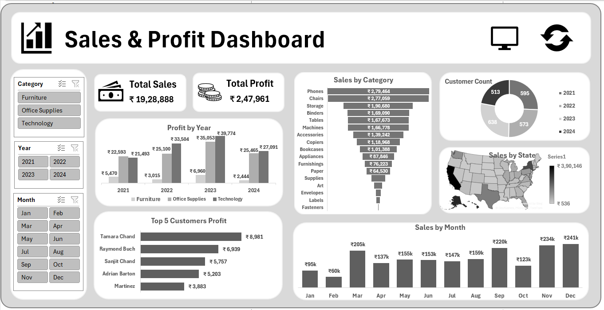

# 📊 Sales & Profit Dashboard (Excel)

An **interactive Sales & Profit Dashboard built using Microsoft Excel** that provides insights into sales performance, profit trends, customer contribution, and regional sales distribution.

This dashboard uses **Pivot Tables, Pivot Charts, Slicers, and VBA automation** to create a dynamic and user-friendly analytics tool.

---

## 📷 Dashboard Preview

---

## 🚀 Features

### 📌 Interactive Filters
Users can filter the entire dashboard using slicers:

- Category: Furniture, Office Supplies, Technology
- Year: 2021 – 2024
- Month: January – December

These filters dynamically update all charts and metrics.

---

### 📊 Key Performance Indicators (KPIs)

The dashboard displays important business metrics:

- **Total Sales**
- **Total Profit**

These KPIs update automatically when filters are applied.

---

### 📈 Data Visualizations

The dashboard includes multiple visual insights:

- **Profit by Year** – yearly profit comparison by category  
- **Sales by Category** – performance of different product categories  
- **Customer Count by Year** – yearly customer growth  
- **Top 5 Customers by Profit** – most valuable customers  
- **Sales by Month** – monthly sales trend  
- **Sales by State (Map)** – geographic sales distribution  

---

### 🔄 Refresh Button (VBA Automation)

The dashboard includes a **custom Refresh Button created using VBA**.

This button allows users to **instantly refresh all Pivot Tables and dashboard data** without manually updating each element.

#### VBA Functionality
- Refreshes all pivot tables
- Updates charts automatically
- Improves dashboard usability

## 🛠 Tools & Skills Used

- Microsoft Excel
- Pivot Tables
- Pivot Charts
- Excel Slicers
- VBA (Visual Basic for Applications)
- Data Visualization
- Dashboard Design
- Data Analysis

---

## 🎯 Project Objective

The goal of this project is to **convert raw sales data into meaningful insights through an interactive dashboard**.

It helps users quickly analyze:

- Sales performance by category
- Profit trends across multiple years
- Top customers generating profit
- Monthly sales patterns
- Regional sales performance

---

## 📈 Example Insights

Using this dashboard, users can easily identify:

- Highest revenue-generating product categories
- Monthly sales fluctuations
- Top profit-generating customers
- Regional sales performance trends

---
